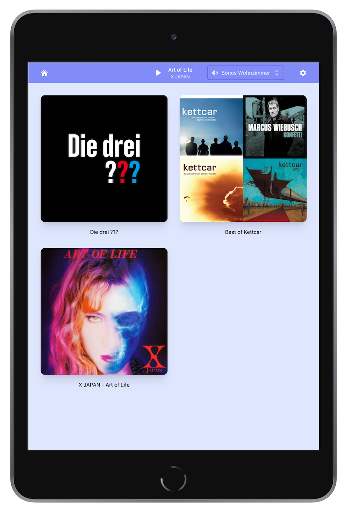

# Kioski

A simple web app to play things on your Home Assistant Media Players (e.g. Sonos speakers).



## How to run

## Locally

```bash

cp .env.example .env
touch database.sqlite

# Edit .env to your needs, especially the database file path (needs to be absolute)

composer install
php artisan key:generate
php artisan migrate
php artisan storage:link
php artisan serve

# Or configure nginx / apache / your favorite web server

```

## Docker

Use the ready-to-use docker image from [Docker Hub](https://hub.docker.com/r/pwaldhauer/kioski/).

```bash

touch db.sqlite
docker run -d \
 -p 127.0.0.1:9901:9901 \
 -v $(pwd)/db.sqlite:/app/database.sqlite \
 pwaldhauer/kioski:0.1.0    
 
```
